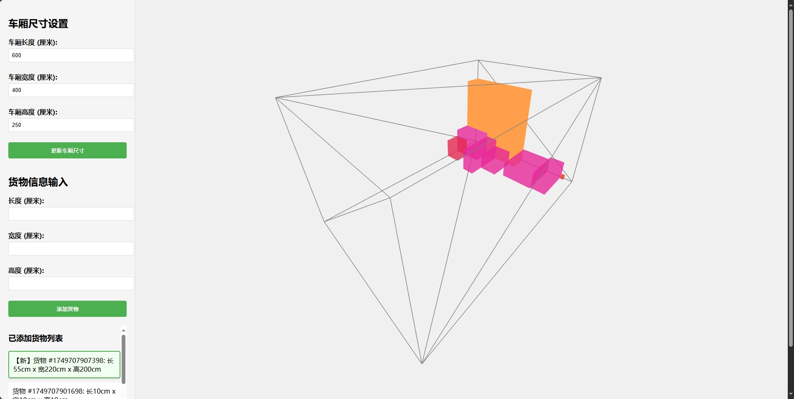

# 3D 货物装载可视化系统 (3D Cargo Loading Visualizer)

一个基于 Three.js 的物流配送车货物自动规划系统，提供实时 3D 可视化界面。

## 功能特点

- 3D 实时可视化货物装载过程
- 智能货物布局算法
  - 优先大件货物摆放
  - 自动堆叠优化
  - 空间利用最大化
- 交互式操作界面
  - 支持鼠标拖拽旋转视角
  - 实时调整车厢尺寸
  - 动态添加货物
- 货物管理功能
  - 可视化货物列表
  - 新增货物高亮显示
  - 自动移除无法放置的货物

## 技术栈

- Three.js - 3D 渲染引擎
- HTML5/CSS3 - 页面布局和样式
- JavaScript - 业务逻辑实现

## 使用方法

1. 设置车厢尺寸
   - 输入长度、宽度、高度
   - 点击"更新车厢尺寸"应用更改

2. 添加货物
   - 输入货物的长度、宽度、高度
   - 点击"添加货物"将货物加入系统

3. 查看效果
   - 使用鼠标拖拽旋转查看不同角度
   - 使用鼠标滚轮缩放视图
   - 查看右侧列表了解货物详情

## 效果展示



## 本地运行

1. 克隆仓库
```bash
git clone git@github.com:497187419/3d-cargo-loading-visualizer.git
```

2. 直接在浏览器中打开 `index.html` 文件即可运行

## 开源协议

MIT License